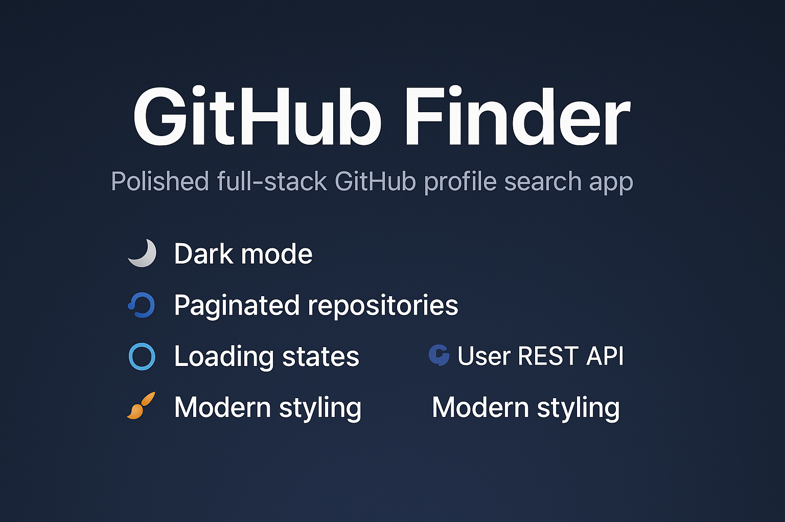

# 🔍 GitHub Finder

A full-stack GitHub profile search app built with React + TypeScript + Tailwind CSS on the frontend, and Node.js + Express on the backend. 

Includes:

- 🌗 Dark mode
- 🔁 Pagination of repositories
- 🌀 Loading states
- 🔍 GitHub REST API integration via a backend proxy
- 🧠 Fully commented and styled using modern Tailwind classes

---

## 📦 Tech Stack

### Frontend
- React + TypeScript (Vite)
- Tailwind CSS
- GitHub REST API
- Axios / native fetch

### Backend
- Node.js + Express
- CORS + Helmet
- Proxy endpoint: `/api/github/:username?page=n`

---

## ✨ Features

- Search any GitHub user
- View name, avatar, bio, follower stats, and public repos
- Paginated list of repositories (5 per page)
- Dark mode toggle
- Loading spinner during fetch
- Backend handles GitHub API calls and pagination
- Secure CORS + error handling

---

## 💻 Installation (Local Setup)

```bash
# Clone repo
git clone https://github.com/M-S-Brough/github-finder.git
cd github-finder

# Frontend
npm install
npm run dev

# In a separate terminal: start backend
cd backend
npm install
node server.js
```

> Frontend: http://localhost:5173  
> Backend: http://localhost:5000

---

## 🧪 Usage

- Open the frontend in your browser
- Enter a GitHub username (e.g. `vercel`)
- View their profile and 5 latest repos
- Use pagination buttons to browse more
- Toggle light/dark theme

---

## 🧠 Learning Goals

This project demonstrates:
- End-to-end data flow across full-stack
- Use of REST APIs through a custom proxy
- Frontend architecture and UI/UX best practices
- Pagination, state handling, and error feedback
- Backend expansion potential (caching, logging, auth)

---

## 📁 Folder Structure

```
github-finder/
├── backend/
│   └── server.js
├── public/
├── src/
│   ├── components/
│   │   └── Search.tsx
│   ├── App.tsx
│   ├── index.css
│   └── main.tsx
├── tailwind.config.js
└── README.md
```

---

## 👨‍💻 Author

**Mark Brough**  
[GitHub Profile →](https://github.com/M-S-Brough)

---

> This full-stack GitHub Finder app demonstrates real-world skills in frontend UI, backend API proxying, and user-friendly features like dark mode and loading feedback.